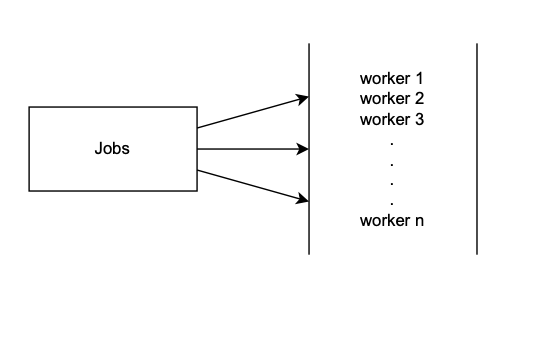
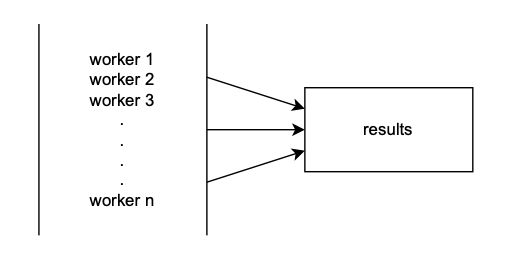

# Worker Pool

## Fan-out

The fan-out means assigning things to worker pool as shown below.

---

---

## Fan-in

The fan-int means to gather the results of each worker's execution as shown below.

---

---
